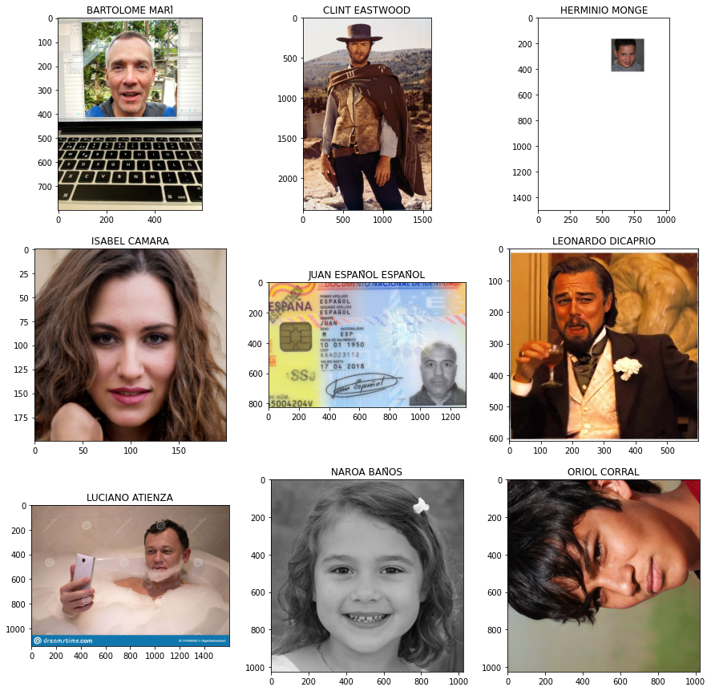

# Demo de redes neuronales: orla de alumnos

Demostración preparada para la [I Jornada de IA en la FP](http://portal.edu.gva.es/cida/es/i-jornada-de-inteligencia-artificial-en-la-formacion-profesional).

# Paso 1 - Entrenar TiltNet

 y seguir las instrucciones de la primera celda del cuaderno.

# Paso 2 - Generar la orla a partir de fotos enviadas por los alumnos

 y seguir las instrucciones del cuaderno.

